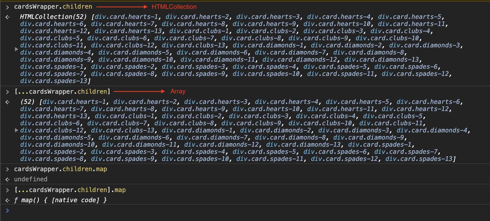

# Smart Magic Cards
Join Smart by performing a simple magic trick.

A magician has a deck of cards, 52 cards, 13 of each suit (Hearts, Diamonds, Clubs and Spades).<br>
He will show us all of the cards and we will see that they are ordered and sorted by suit.<br>
We are asked to shuffle the deck.<br>
Then the magician askes us to pick a single card.<br>
When the magician reveals the deck of cards once more, the picked card is removed as well as all the related valued cards.<br>
Eg. the 8 of hears it picked, now all the 8's are removed from the deck and added to the picked card.<br>

### Requirements
- Make sure all 4 suits of cards are rendered and sorted by suit. There are 13 cards in each suit ( ♥, ♣, ♦, ♠ ).
- Make sure the value for each card is visible on the initial render, basically move each card a bit so the card is readable.
- Add 3 buttons to the flow that will allow you to do 3 actions:
  - **Shuffle:** Randomly shuffles all cards.
  - **Flip cards:** Turn all the cards face down by adding a class (CSS is already included).
  - **Magic:** Remove all related cards from the deck after picking a card. (Only display this button after a card has been picked).
- Create the functionality to pick a card, by clicking on a random card.
- When the trick is performed (by clicking the magic button), move the related cards to the picked card.

#### Bonus points
  - Find a way to remove duplications in the `cards.scss` file and generate all the classes automatically for the cards: `.hearts-1`, `.hearts-2`, ... , `.spades-13`.
  - Add animation.
  - Do not use images for the cards, style them with CSS/SCSS only.
  - Uncomment the tests in the `cypress/integration/magic-trick.js` file and **make sure the tests pass**.
  - Add additional tests (we like test coverage).
  - Usuage of drag and drop to pick a card.
  - Having a way of resetting the app, withouth reloading the page.
  - Do not break any linting rules. (The linter runs before tests)
  - Add some extra functionality, this is your chance to be creative. 😉

#### Example


## Getting Started
Follow these steps to get the project setup on your machine.

### Clone the repository
```
git clone git@github.com:smartpension/smart-magic-cards.git
```
_Note:_ You won't have access to commit to this repository. We suggest you download it or fork it.


### Install
```
$ yarn install
```

### Develop
As this is just a static application, opening the `index.html` page in the browser should show you the app.<br>
In order to use the SASS compiler, run the following command.
```
$ yarn develop
```

### Test
In order to run the tests, run one of the folowing commands.
```
$ yarn test       # Test once
$ yarn serve-test # Open and serve the tests
```
_Note:_ [Cypress.io](https://www.cypress.io/) is included in the project and all tests will run with Github Actions.


### Hints
- When performing the trick, use the existing cards rather then create new ones.
- There is a diffirence between an [`array`](https://developer.mozilla.org/en-US/docs/Web/JavaScript/Reference/Global_Objects/Array) and a [`HTMLCollection`](https://www.w3schools.com/js/js_htmldom_collections.asp).<br>
The latter does not have the [`array methods`](https://developer.mozilla.org/en-US/docs/Web/JavaScript/Reference/Global_Objects/Array#Common_operations), to convert a `HTMLCollection` into an `array`, you can simply destructure it `[...HTMLCollection]`<br>

